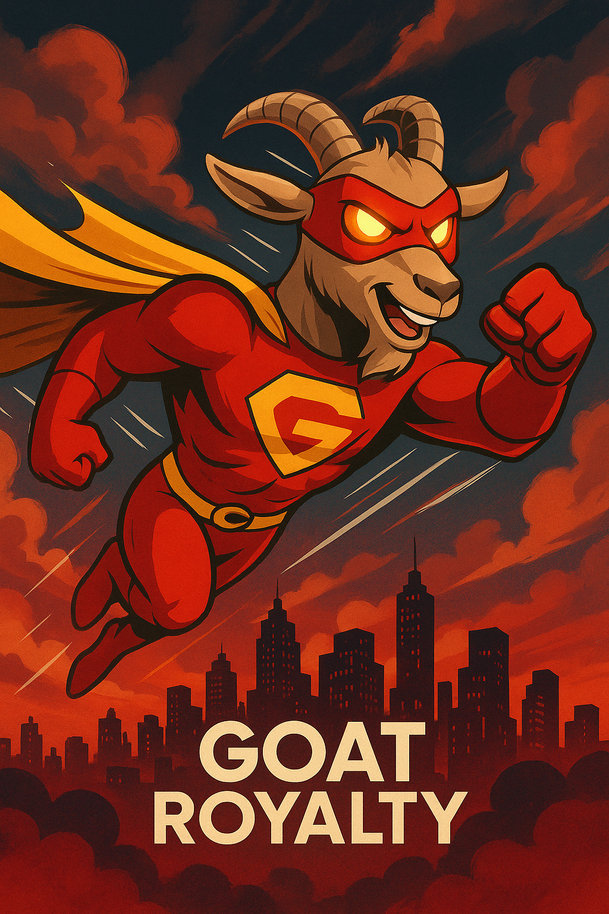

<p align="center">
  
</p>

<h1 align="center">🐐 GOAT Royalty Platform</h1>

<p align="center">
  Ms Money Penny Store &bull; Living Investor EPK &bull; Halito Chat &bull; GOAT City RP &bull; Cinema Forge &bull; Agents Brain
</p>

---

## What's inside

Static, dependency-free web platform. Open `index.html` in any browser or serve the folder with any static host (Hostinger, GitHub Pages, `python3 -m http.server`).

| Page | Description |
| --- | --- |
| `index.html` | Ms Money Penny — GOAT Royalty Store & command center |
| `goat-investor-living-epk.html` / `START-HERE-GOAT-Investor-Living-EPK.html` | Living Investor EPK with money breakdown, hardware manifest, and proof media |
| `money-breakdown.html` | Investor money breakdown (backed by `data/goat-money-breakdown.{json,csv}`) |
| `super-goat-royalties.html` | Super GOAT Royalties tracker |
| `goat-apps.html` | Standalone app launcher |
| `agents-brain.html` | GOAT Agents Brain — AI command center |
| `goat-cinema-forge.html` | Hollywood studio router |
| `goat-virtual-world-rp.html` | GOAT City RP (Cfx.re / FiveM) hub |
| `halito-chat.html` | Halito Chat — offline mesh messaging |
| `goat-royalty-force.html` | GOAT Royalty Force — the team, the lore, the series pitch |

## Structure

```
├── *.html                  # App pages (self-contained)
├── css/                    # Shared GOAT theme, brand, and touch styles
├── js/                     # Runtime, store restore, casino, audio engine, etc.
├── data/                   # Money breakdown, hardware, and RP manifests
├── assets/epk-media/       # EPK proof audio, video, and studio images
└── manifest.json           # PWA manifest
```

## Local preview

```bash
python3 -m http.server 8080
# open http://localhost:8080/
```

## Evaluation

See [EVALUATION.md](EVALUATION.md) for the latest full-platform evaluation, page-by-page status, and remaining gaps.
